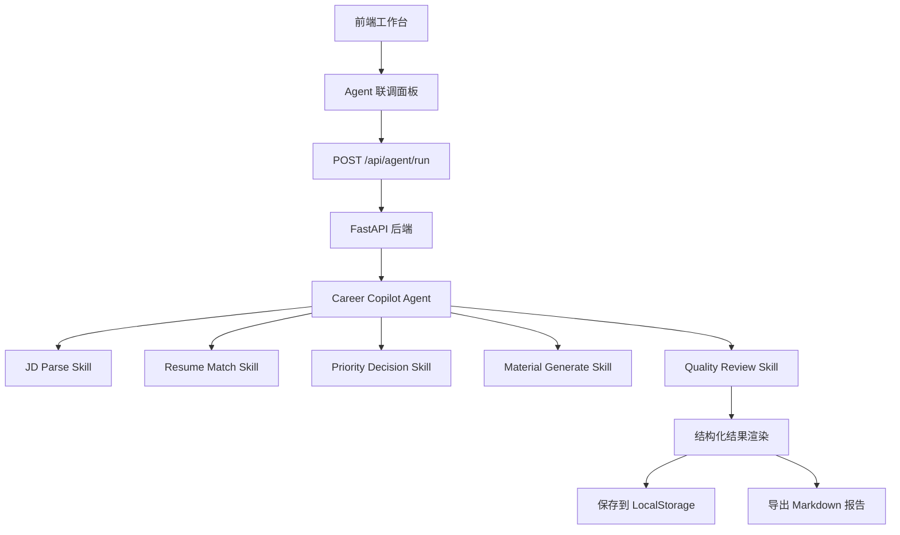

# AI 求职投递助手｜Career Copilot Agent MVP

当前版本：V2.3：线上部署适配。

当前状态：Career Copilot Agent MVP Showcase 本地可运行版本验收通过，已进入线上部署适配。
后端端口：8001
前端端口：5500

本项目已从 GitHub Pages 静态 Demo 升级为可运行、可验收、可展示的 Career Copilot Agent MVP：前端保留原有工作台风格，通过 FastAPI 后端调用 `POST /api/agent/run`，完成 JD 解析、简历匹配、投递优先级判断、材料生成、质量审核和下一步建议。V2.3 重点完成线上部署适配，让项目具备本地可运行、线上可接入、作品集可说明的交付形态。

## 版本进度

```text
V1.0 静态交互 Demo
V1.5 FastAPI 后端接口版
V2.0 Career Copilot Agent MVP
V2.1 Agent 输出评估与报告导出版
V2.2 Agent MVP Showcase
V2.3 线上部署适配版
V3.0 数据库记忆与投递看板版
V4.0 多 Agent 协作版
```

## 从 Demo 到 Agent MVP 的升级路径

本项目最初是 AI 求职投递助手交互 Demo，用于验证 JD 解析、简历匹配、材料生成、投递看板等核心流程。V2.0 版本进一步引入 FastAPI 后端，将 JD 解析、简历匹配、投递优先级判断、材料生成和质量审核封装为 Agent 工作流。V2.1 版本加入真实岗位输出评估、分析结果保存和 Markdown 报告导出，使项目从一次性生成工具升级为可执行、可解释、可复盘的 Career Copilot Agent MVP。V2.2：Agent MVP Showcase 进一步补充作品集叙事和页面说明，让项目更适合面试展示。V2.3 进一步补充前端 API 配置入口、后端 CORS 白名单、健康检查说明和部署指南，为后端上线与前端接入公网 API 做准备。

## 项目架构图



## Agent 工作流图


## 为什么这是 Agent，而不是普通 Prompt Demo

本项目不是单次 Prompt 文案生成，而是围绕“是否值得投递、如何准备材料、如何跟进复盘”这一目标，将求职投递流程拆解为多个可执行 Skill。系统通过 `/api/agent/run` 串联 JD 解析、简历匹配、优先级判断、材料生成和质量审核，每一步都有结构化输出，并支持保存和导出，形成可追踪、可复盘的 Agent 工作流。

## 输出质量评估方法

输出质量评估记录见 [`docs/agent_evaluation.md`](docs/agent_evaluation.md)。当前评估方法使用 AI 产品、产品运营 / 商业化运营、数据运营 / 数据产品 3 类真实岗位样例，检查 JD 解析准确性、匹配评分合理性、证据真实性、能力缺口具体性、投递材料可用性、质量审核有效性和下一步行动建议的可执行性。

## 作品集展示与部署说明

当前展示方式不依赖录屏，重点放在三类可验收材料：

- 本地可运行：后端 `8001` + 前端 `5500`，可完整跑通 Agent 联调、保存分析和 Markdown 报告导出。
- 线上部署说明：见 [`docs/deployment_guide.md`](docs/deployment_guide.md)，包含后端部署、前端 API 地址配置、线上验收步骤和常见问题。
- 项目截图 / 结构说明：建议准备首页项目说明截图、Agent 联调运行结果截图、Markdown 报告导出结果截图。

前端提供统一配置入口：

```javascript
window.CAREER_COPILOT_CONFIG = window.CAREER_COPILOT_CONFIG || {
  API_BASE_URL: 'http://127.0.0.1:8001'
};
```

本地默认使用 `http://127.0.0.1:8001`；后端上线后可替换为 `https://xxx.onrender.com` 或其他云端地址。

## 启动后端

```powershell
cd "C:\Users\86173\Documents\AI求职投递助手\career-copilot-agent-service"
$env:PYTHONPATH='.'
python -m uvicorn app.main:app --host 127.0.0.1 --port 8000
```

若 8000 端口出现 WinError 10013 权限问题，可改用 8001 启动后端：

```powershell
python -m uvicorn app.main:app --host 127.0.0.1 --port 8001
```

前端 Agent 联调面板中的 API 地址同步填写：

```text
http://127.0.0.1:8001
```

如果本机默认 `python` 指向旧版本，请先激活后端 `.venv`，或使用 Python 3.10+ 的解释器。

Swagger：

```text
http://127.0.0.1:8001/docs
```

如果后端使用 8000 端口，也可以打开：

```text
http://127.0.0.1:8000/docs
```

## 打开前端

```powershell
cd "C:\Users\86173\Documents\AI求职投递助手"
python -m http.server 5500 --bind 127.0.0.1
```

浏览器打开：

```text
http://127.0.0.1:5500/index.html
```

进入工作台里的「Agent 联调」标签：

1. 点击「填充联调样例」。
2. 点击「一键运行 Career Copilot Agent」。
3. 结果生成后可点击「保存本次分析」，写入 LocalStorage。
4. 可点击「导出分析报告」，下载 Markdown 报告。

项目讲解脚本与面试讲稿见 [docs/demo_video_script.md](docs/demo_video_script.md)。

## 前端请求体

前端发送字段严格对齐后端 Pydantic schema：

```json
{
  "jd_text": "岗位 JD 文本",
  "resume_text": "简历或经历摘要",
  "user_profile": {
    "identity": "应届生",
    "target_roles": ["AI产品", "产品经理"],
    "target_cities": ["上海", "杭州"],
    "availability": "每周4天，可实习3个月以上",
    "skills_summary": "Python, SQL, Excel, Prompt, 用户调研, 竞品分析, PRD",
    "portfolio_url": "https://lixuehu123.github.io/AI-/index.html"
  },
  "task": "判断是否值得投递，并生成投递材料"
}
```

## 页面渲染结果

页面展示：

- `jd_analysis`：JD 解析结果
- `resume_match`：简历匹配评分、匹配证据、能力缺口
- `priority_decision`：P0/P1/P2/P3 投递优先级
- `generated_materials`：邮件、BOSS 打招呼、内推和跟进话术
- `quality_review`：虚构风险、夸大风险、关键词遗漏、语气风险
- `recommended_next_action`：下一步行动建议

前端只调用配置的后端 API，不包含 OpenAI API Key。密钥仍由后端 `.env` 或部署平台环境变量管理。

## 输出质量评估记录

评估文档：

```text
docs/agent_evaluation.md
```

当前已用 3 类真实岗位样例测试：

- AI产品实习生
- 产品运营 / 商业化运营实习生
- 数据运营 / 数据产品实习生

评估维度包括：JD解析是否准确、匹配评分是否合理、`matched_evidence` 是否真实、`missing_evidence` 是否具体、投递材料是否可用、`quality_review` 是否发现风险、`recommended_next_action` 是否具体。

本轮已根据评估结果优化匹配逻辑：非 AI 岗不再因为 AI Demo 自动加分，运营/数据/AI 岗分别检查岗位场景证据，避免评分虚高。

## 测试

后端测试：

```powershell
cd "C:\Users\86173\Documents\AI求职投递助手\career-copilot-agent-service"
$env:PYTHONPATH='.'
python -m unittest discover -s tests -v
```

前端与评估文档测试：

```powershell
cd "C:\Users\86173\Documents\AI求职投递助手"
python -m unittest discover -s tests -v
```

如果测试环境没有 FastAPI 依赖，请使用后端虚拟环境或 Codex bundled Python 执行。

## 本阶段修改文件

- `index.html`：新增保存本次分析、导出 Markdown 报告、Agent 结果缓存、结构化报告生成、「项目说明 / Agent 架构」展示模块和 `API_BASE_URL` 配置入口。
- `docs/agent_evaluation.md`：新增 3 组真实岗位测试样例、输出摘要和质量评估表。
- `docs/deployment_guide.md`：新增 V2.3 本地运行、后端部署、前端 API 配置、线上验收和常见问题说明。
- `docs/demo_video_script.md`：保留项目讲解脚本和面试讲稿。
- `career-copilot-agent-service/app/skills/match_resume.py`：收紧匹配评分，补充岗位场景证据检查。
- `career-copilot-agent-service/app/agents/career_agent.py`：P1/P2 使用更具体的下一步行动建议。
- `tests/test_frontend_integration.py`、`tests/test_agent_evaluation_docs.py`、`career-copilot-agent-service/tests/test_api.py`：补充对应回归测试。


